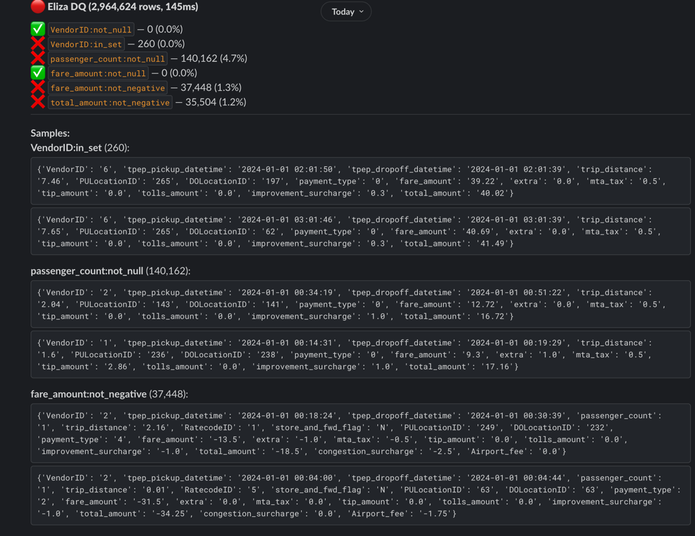
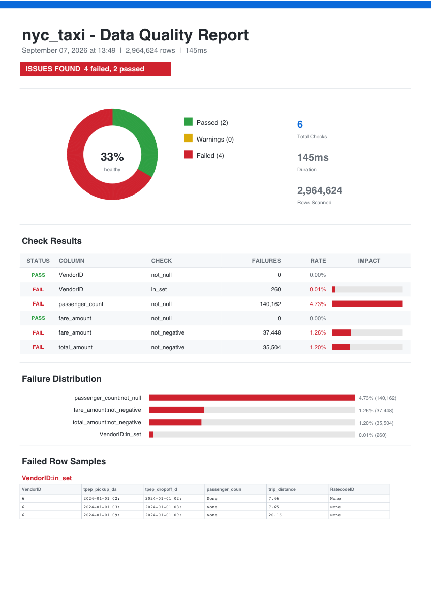

<div align="center">

# Eliza DQ

**The fastest open-source data quality engine for Python.**

*Validate warehouse tables and DataFrames at any scale.*
*Parallel SQL. Single table scan. Failed row samples. Slack alerts. PDF reports.*
*Fewer queries on your DWH = lower cost.*

[](https://github.com/Se7enquick/eliza-dq/actions/workflows/ci.yml)
[](https://pypi.org/project/eliza-dq/)
[](https://pypi.org/project/eliza-dq/)
[](LICENSE)

</div>

---

Eliza DQ runs data quality checks on warehouses and DataFrames. It pushes checks to BigQuery, Athena, Snowflake, and 5 other warehouses with parallel SQL queries, batches everything into a single table scan, and gives you failed row samples via `LIMIT N` (not by fetching all failures into memory). For local data it uses Polars streaming - constant memory, 259M rows from disk in under 2 seconds.

**Drop-in Soda replacement with faster queries and free failed row samples:**

```yaml
# eliza_checks/orders.yaml
connection:
  type: bigquery
  project: my-project-123

table: my-project-123.analytics.orders

checks:
  - column: order_id
    check: not_null
  - column: amount
    check: not_negative
  - column: updated_at
    check: freshness
    max_age: 24h
```

```bash
pip install eliza-dq[bigquery]
eliza check --config orders
# 2 passed, 0 warnings, 1 failed (50,000,000 rows, 8.2s)
```

**Works with DataFrames too:**

```python
from eliza import check

result = check(df, checks={
    "order_id": ["not_null", "unique"],
    "amount":   ["not_null", "not_negative"],
})
result.raise_on_fail()
```

**What you get:**

- **8 warehouse connectors** - BigQuery, Athena, Snowflake, Postgres, ClickHouse, MySQL, Databricks, Redshift. Parallel SQL, single table scan, `LIMIT N` samples
- **17 built-in checks** - not_null, unique, regex, is_email, freshness, schema, FK reference, and more
- **Polars streaming engine** - validates 259M rows from disk in 1.9s with constant memory
- **3 interfaces** - YAML config for production, inline dict for notebooks, CLI for CI/CD
- **Slack alerts with PDF reports** - donut charts, failure distribution, sample tables
- **2 core dependencies** (polars + pyyaml). No numpy. No pandas. No bloat.

## Benchmarks

### SQL Pushdown (Eliza vs Soda)

AWS Athena, Iceberg tables, 8 not_null checks per table, `pyathena` connector.

| Rows | Eliza (no samples) | Eliza (+ 10 samples) | Soda Core* |
|------|-------------------|---------------------|------------|
| **179M** | **9.1s** | **13.2s** | 21.6s |
| **236M** | **13.1s** | **12.2s** | 21.9s |
| **492M** | **15.6s** | **15.1s** | 36.8s |

<sub>* Soda Core OSS does not return failed row samples. `DefaultSampler` is a Cloud-only feature (paid). Eliza returns actual failed rows via `SELECT ... WHERE ... LIMIT N`.</sub>

> **Why this matters for cost:** Eliza batches all inline checks into one `SELECT` (one table scan) and uses `LIMIT N` for samples. Soda runs queries sequentially (multiple scans) and fetches all failing rows without LIMIT. On pay-per-scan warehouses like BigQuery (per-byte) or Soda Cloud (per-SPU), fewer scans = lower cost. Eliza with 10 sample rows is faster than Soda without any samples on every scale tested.

### DataFrame Engine

NYC Yellow Taxi (Parquet). 5 identical checks. Warmup + 3 runs, min time. Apple M-series, Python 3.13.

**In-memory** (pre-loaded Polars DataFrame):

| Rows | Eliza | Cuallee | Pandera | GX |
|------|-------|---------|---------|-----|
| **3M** | **2.3ms** | 7.1ms | 11.4ms | 1,151ms |
| **10M** | **4.4ms** | 11.5ms | 15.0ms | 1,975ms |
| **41M** | **15ms** | 36ms | 43ms | 8,066ms |
| **126M** | **50ms** | 103ms | 130ms | 17,802ms |

**From disk** (total time including file I/O):

| Rows | Eliza | Cuallee | Pandera | GX |
|------|-------|---------|---------|-----|
| **41M** (12 files) | **699ms** | 901ms | 966ms | 9,122ms |
| **126M** (24 files) | **1.3s** | 4.1s | 4.2s | 48.8s |
| **259M** (72 files) | **1.9s** | 11.7s | 12.5s | 201s |

<sub>Eliza streams via Polars LazyFrames (constant memory). Competitors load everything into RAM first. GX requires pandas conversion (adds seconds). Reproducible: `python benchmarks/run.py --full`</sub>

## Eliza vs Competitors

### Features

| Feature | Eliza | Soda | GX | Pandera | Cuallee | Dataframely |
|---------|:-----:|:----:|:--:|:-------:|:-------:|:-----------:|
| Polars native | Yes | - | - | Yes | Yes | Yes |
| LazyFrame streaming | Yes | - | - | - | - | - |
| SQL pushdown | 8 DWH | Yes | Yes | - | - | - |
| Parallel SQL queries | Yes | - | - | - | - | - |
| Failed row samples | `LIMIT N` | All rows* | - | - | - | All rows* |
| YAML config | Yes | Yes | Yes | - | - | - |
| Inline dict API | Yes | - | - | Yes | Yes | Yes |
| CLI | Yes | Yes | Yes | - | - | - |
| Auto-learn from data | Yes | - | Yes | Yes | - | - |
| PDF report | Yes | - | - | - | - | - |
| Slack alerting | Yes | Cloud** | - | - | - | - |
| Partition filter | Yes | Yes | Yes | - | - | - |
| Schema validation | Yes | Yes | Yes | Yes | - | Yes |
| FK reference check | Yes | Yes | Yes | - | - | - |
| Core dependencies | **2** | 30+ | 30+ | 7+ | 3+ | 2 |

<sub>* Materializes all failing rows in memory before truncating - causes OOM/timeout on large failures.</sub><br>
<sub>** Soda Slack alerting requires Soda Cloud (paid).</sub>

### Checks

| Check | Eliza | Soda | GX | Pandera | Cuallee |
|-------|:-----:|:----:|:--:|:-------:|:-------:|
| not_null | Yes | Yes | Yes | Yes | Yes |
| not_missing (custom) | Yes | Yes | Yes | - | - |
| unique | Yes | Yes | Yes | Yes | Yes |
| not_negative | Yes | Yes | Yes | Yes | Yes |
| between (range) | Yes | Yes | Yes | Yes | Yes |
| in_set | Yes | Yes | Yes | Yes | Yes |
| regex | Yes | Yes | Yes | Yes | Yes |
| is_email | Yes | - | - | - | - |
| is_url | Yes | - | - | - | - |
| min/max_length | Yes | Yes | Yes | - | - |
| freshness | Yes | Yes | - | - | - |
| row_count | Yes | Yes | Yes | - | - |
| cross_column | Yes | - | Yes | Yes | - |
| schema | Yes | Yes | Yes | Yes | - |
| reference (FK) | Yes | Yes | Yes | - | - |
| custom SQL | Yes | Yes | Yes | - | - |
| anomaly detection | - | Cloud | Yes | - | - |
| distribution | - | Cloud | Yes | - | - |
| change over time | - | Cloud | - | - | - |

### Warehouse Support

| Warehouse | Eliza | Soda | GX |
|-----------|:-----:|:----:|:--:|
| BigQuery | Yes | Yes | Yes |
| Athena | Yes | Yes | Yes |
| Snowflake | Yes | Yes | Yes |
| PostgreSQL | Yes | Yes | Yes |
| MySQL | Yes | Yes | Yes |
| ClickHouse | Yes | - | - |
| Databricks | Yes | Yes | Yes |
| Redshift | Yes | Yes | Yes |

```bash
pip install eliza-dq[bigquery]   # install only what you need
pip install eliza-dq[athena]
pip install eliza-dq[snowflake]
pip install eliza-dq[postgres]
pip install eliza-dq[clickhouse]
pip install eliza-dq[mysql]
pip install eliza-dq[databricks]
pip install eliza-dq[redshift]
```

**DWH (SQL pushdown)** - checks run as SQL queries directly on the warehouse:

```yaml
# eliza_checks/analytics.yaml
connection:
  type: bigquery
  project: my-project-123

table: my-project-123.analytics.orders

checks:
  - column: order_id
    check: not_null
```

**OLTP (local engine)** - data is pulled from the database, checked locally with Polars:

```yaml
# eliza_checks/prod_orders.yaml
connection:
  type: postgres
  host: prod-db.internal
  port: 5432
  user: readonly
  password: ${DB_PASSWORD}
  database: production

engine: local
table: orders
filter: "created_at >= '2024-01-01'"

checks:
  - column: order_id
    check: not_null
```

<details>
<summary>Connection examples for all warehouses</summary>

```yaml
# BigQuery
connection:
  type: bigquery
  project: my-project
  location: US    # optional

# Athena
connection:
  type: athena
  region: us-east-1
  schema: my_database
  s3_staging_dir: s3://bucket/athena-results/

# Snowflake
connection:
  type: snowflake
  account: xy12345.us-east-1
  user: eliza_user
  password: ${SF_PASSWORD}
  warehouse: COMPUTE_WH
  database: ANALYTICS
  schema: PUBLIC

# PostgreSQL
connection:
  type: postgres
  host: localhost
  port: 5432
  user: postgres
  password: ${PG_PASSWORD}
  database: mydb

# MySQL
connection:
  type: mysql
  host: localhost
  user: root
  password: ${MYSQL_PASSWORD}
  database: mydb

# ClickHouse
connection:
  type: clickhouse
  host: localhost
  port: 8123
  user: default
  database: mydb

# Databricks
connection:
  type: databricks
  host: adb-123.azuredatabricks.net
  http_path: /sql/1.0/warehouses/abc
  token: ${DBX_TOKEN}

# Redshift
connection:
  type: redshift
  host: cluster.region.redshift.amazonaws.com
  database: analytics
  user: eliza_user
  password: ${RS_PASSWORD}
```

</details>

## Quick Start

### Inline checks (notebook / script)

```python
import polars as pl
from eliza import check

df = pl.read_parquet("orders.parquet")

result = check(df, checks={
    "order_id": ["not_null", "unique"],
    "amount":   ["not_null", "not_negative", {"between": {"min": 0, "max": 100000}}],
    "email":    ["is_email"],
    "status":   [{"in_set": {"values": ["pending", "shipped", "delivered"]}}],
    "name":     [{"min_length": {"min": 2}}, {"max_length": {"max": 100}}],
})

print(result.summary())
result.raise_on_fail()  # exit code 1 on failure
```

### YAML config (production)

```yaml
# eliza_checks/orders.yaml
connection:
  type: bigquery
  project: my-project-123

table: my-project-123.analytics.orders

filter: "created_at >= '2024-01-01'"

samples:
  limit: 20

checks:
  - column: order_id
    check: not_null
  - column: order_id
    check: unique
  - column: amount
    check: not_negative
  - column: email
    check: not_missing
    missing_values: ["", "N/A", "null"]
  - column: updated_at
    check: freshness
    max_age: 24h
  - check: row_count
    min: 1000
```

```python
from eliza import check
result = check(config="orders")
```

### CLI

```bash
# Initialize project
eliza init

# Auto-learn checks from data
eliza learn data/orders.parquet --name orders

# Run checks (exit code: 0=pass, 1=fail, 2=error)
eliza check --config orders --source data/orders.parquet

# JSON output for orchestrators
eliza check --config orders --format json
```

## Alerting & Reporting

```python
from eliza import check
from eliza.alert import send_slack
from eliza.report import generate_pdf

result = check(config="orders")

# Slack message + PDF attachment
send_slack(result, token="xoxb-...", channel="C...", pdf=True, name="orders")

# PDF report with charts (donut, failure bars, sample tables)
generate_pdf(result, name="orders")
# -> eliza_orders_2026-09-07.pdf
```

```bash
pip install eliza-dq[report]  # for PDF reports
```

<table>
<tr>
<td width="50%">

**Slack Alert**



</td>
<td width="50%">

**PDF Report**



</td>
</tr>
</table>

## Orchestrator Integration

### Airflow

```python
from airflow.decorators import task

@task
def dq_check():
    from eliza import check
    from eliza.alert import send_slack

    result = check(config="orders")

    if not result.passed():
        send_slack(result, token="xoxb-...", channel="C...", pdf=True, name="orders")

    result.raise_on_fail()  # fails the Airflow task
    return result.to_dict()  # saved to XCom
```

### Dagster

```python
from dagster import asset, asset_check, AssetCheckResult

@asset
def orders():
    df = load_orders()

    from eliza import check
    result = check(df, config="orders")
    result.raise_on_fail()

    return df

@asset_check(asset=orders)
def orders_quality():
    from eliza import check
    result = check(config="orders")
    return AssetCheckResult(
        passed=result.passed(),
        metadata={"summary": result.summary(), "failed": result.exit_code},
    )
```

### Prefect

```python
from prefect import flow

@flow
def dq_flow():
    from eliza import check
    from eliza.alert import send_slack

    result = check(config="orders")

    if not result.passed():
        send_slack(result, webhook="https://hooks.slack.com/services/...")

    result.raise_on_fail()
```

### GitHub Actions

```yaml
# .github/workflows/dq.yml
steps:
  - run: pip install eliza-dq
  - run: eliza check --config orders --source data/orders.parquet
  # exit code 1 on failure = step fails = PR blocked
```

### Any orchestrator

```python
from eliza import check

result = check(config="orders")

result.raise_on_fail()   # RuntimeError on failure (Airflow, Dagster, Prefect)
result.exit_code         # 0=pass, 1=fail, 2=error (bash, CLI, GitHub Actions)
result.to_dict()         # dict for XCom, metadata, logging
result.to_json()         # JSON string for APIs
result.summary()         # "3 passed, 1 failed (1,000,000 rows, 42ms)"
```

## Architecture

**Polars native** (DataFrames, files): Streaming engine with per-column grouping. Files are scanned as LazyFrames - data streams through without loading into RAM. Each column group runs one `collect(engine="streaming")` call. Failed row samples use `.filter().head(N).collect(engine="streaming")` - instant, no full materialization.

**SQL pushdown** (warehouses): All inline checks batched into one `SELECT COUNT(*), SUM(CASE WHEN ...) FROM table`. Separate checks (unique, freshness) and sample queries run in parallel via `ThreadPoolExecutor` with thread-local connections. Sample queries use `LIMIT N` in SQL - never fetches all failing rows.

## License

MIT
